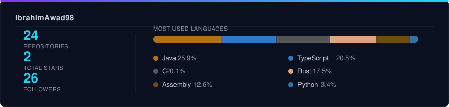
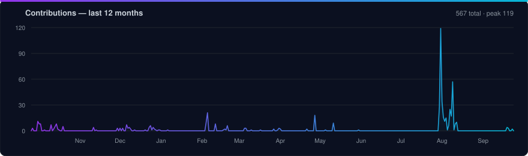

<p align="center">
  <a href="https://www.linkedin.com/in/ibrahim-awad-31a73a2aa">
    
  </a>
  <a href="mailto:ibrahimawad98@hotmail.com">
    
  </a>
  <a href="https://github.com/IbrahimAwad98?tab=repositories">
    
  </a>
</p>

<p align="center">
  
</p>


## About Me

Computer science engineering student at **KTH Royal Institute of Technology**, based in Stockholm.

I build complete systems — from **bare-metal embedded code (RISC-V, C)**, up through **backend services and databases**, to **modern frontend interfaces**.

My focus is writing clean code, understanding systems end-to-end, and solving real problems rather than tutorial exercises.

```rust
struct Developer {
    name:     &'static str,
    role:     &'static str,
    focus:    [&'static str; 3],
    learning: &'static str,
    open_to:  &'static str,
}

fn main() {
    let me = Developer {
        name:     "Ibrahim Awad",
        role:     "Fullstack Developer",
        focus:    ["Systems & Embedded", "Databases", "Web"],
        learning: "Rust",
        open_to:  "Graduate roles · Thesis projects · Collaboration",
    };

    println!("Let's build something solid. 🦀");
}
```


## Experience

<table>
  <tr>
    <td valign="top" width="30%">
      <b>Software Engineering Intern</b><br/>
      <em>Sid Marketing</em><br/>
      <sub>2026</sub>
    </td>
    <td valign="top" width="70%">
      <p>Contributed to <b>Sid Platform</b>, a production billing and invoicing system, as part of a small engineering team working in a full code-review culture.</p>
      <p>Shipped a customer-facing switchover flow that let organizations migrate their billing setup without support involvement, along with a Stripe-mode billing interface. Worked across the stack in an existing codebase — reading unfamiliar code, matching established patterns, and defending design decisions in review.</p>
      <p>
        
        
        
        
      </p>
      <p><sub><i>Code is proprietary and not public.</i></sub></p>
    </td>
  </tr>
</table>


## Tech Stack

<table>
  <tr>
    <td><b>Languages</b></td>
    <td></td>
  </tr>
  <tr>
    <td><b>Frontend</b></td>
    <td></td>
  </tr>
  <tr>
    <td><b>Backend &amp; Data</b></td>
    <td></td>
  </tr>
  <tr>
    <td><b>Cloud &amp; DevOps</b></td>
    <td></td>
  </tr>
  <tr>
    <td><b>Testing &amp; Design</b></td>
    <td></td>
  </tr>
</table>

<p align="center">
  
  
  
  
  
  
  
</p>


## AI-Assisted Development

<p align="center">
  <sub><b>MODELS</b></sub><br/>
  
  
  
</p>

<p align="center">
  <sub><b>ENVIRONMENTS</b></sub><br/>
  
  
  
</p>

AI is part of my toolchain, not a replacement for understanding the system. I use it to iterate faster while staying accountable for every line that ships.

<table>
  <tr>
    <td width="33%" valign="top">
      <h4>Architecture &amp; Review</h4>
      <p><em>Claude · Claude Code</em></p>
      <p>Design discussions, refactoring across larger codebases, and critical review of my own solutions before they land.</p>
    </td>
    <td width="33%" valign="top">
      <h4>In-Editor Flow</h4>
      <p><em>Cursor · Copilot</em></p>
      <p>Multi-file edits with the whole repo in context, inline completion, and fast iteration without leaving the editor.</p>
    </td>
    <td width="33%" valign="top">
      <h4>Research &amp; Scaffolding</h4>
      <p><em>Gemini · Codex</em></p>
      <p>Exploring unfamiliar APIs and specs, generating boilerplate and test coverage — so time goes into the parts that require thinking.</p>
    </td>
  </tr>
</table>

> **Principle:** every AI-generated suggestion gets read, questioned and tested before it enters a project. The value is speed of iteration — not skipping the engineering.


## Featured Projects

<table>
  <tr>
    <td width="50%" valign="top">
      <h3>🏎️ <a href="https://github.com/IbrahimAwad98/Road-Rumble">Road Rumble</a></h3>
      <p><em>C · SDL2 · UDP Networking</em></p>
      <p>Multiplayer racing game with real-time UDP client–server communication and cross-platform support. Built in a SCRUM team.</p>
      <p>
        
        
        
      </p>
    </td>
    <td width="50%" valign="top">
      <h3>🌤️ <a href="https://github.com/IbrahimAwad98/Weather-App-via-React">Weather App</a></h3>
      <p><em>Next.js · React · TypeScript</em></p>
      <p>Weather application fetching live OpenWeatherMap data, with typed API responses, error handling and dark mode.</p>
      <p>
        
        
        
      </p>
    </td>
  </tr>
  <tr>
    <td width="50%" valign="top">
      <h3>📚 Library Systems (<a href="https://github.com/IbrahimAwad98/LibraryMySQL">MySQL</a> · <a href="https://github.com/IbrahimAwad98/LibraryMongoDB">MongoDB</a>)</h3>
      <p><em>Java · JavaFX · MySQL / MongoDB</em></p>
      <p>Library management client built twice — against MySQL with prepared statements and against MongoDB — same MVC architecture with an interface-driven data layer, login, search, reviews and ratings.</p>
      <p>
        
        
        
      </p>
    </td>
    <td width="50%" valign="top">
      <h3>⚙️ <a href="https://github.com/IbrahimAwad98/riscv-baremetal">RISC-V Bare-Metal</a></h3>
      <p><em>C · Assembly</em></p>
      <p>Bare-metal programming on the GD32VF103 microcontroller: GPIO, ADC, PWM, DAC and LCD drivers written from the register level up, plus RISC-V assembly labs.</p>
      <p>
        
        
        
      </p>
    </td>
  </tr>
  <tr>
    <td width="50%" valign="top">
      <h3>🧠 <a href="https://github.com/IbrahimAwad98/Algorithms-and-data-structure">Algorithms &amp; Data Structures</a></h3>
      <p><em>Java</em></p>
      <p>Data structures and algorithms implemented from scratch — generic BST, linked lists, stacks and queues, sorting, and backtracking solvers for mazes and N-Queens.</p>
      <p>
        
        
      </p>
    </td>
    <td width="50%" valign="top">
      <h3>🗄️ <a href="https://github.com/IbrahimAwad98/Database">Database Design</a></h3>
      <p><em>MySQL · ER Modeling</em></p>
      <p>Normalized MySQL schema for a library system — junction tables for M:N relations, cascading foreign keys and a full ER diagram.</p>
      <p>
        
        
        
      </p>
    </td>
  </tr>
</table>


## GitHub Stats

<p align="center">
  
</p>

<p align="center">
  
</p>

<p align="center">
  
</p>


## Current Focus

<p align="center">
  
  
  
</p>


## Contact

<p align="center">
  <a href="mailto:ibrahimawad98@hotmail.com">
    
  </a>
  &nbsp;
  <a href="https://www.linkedin.com/in/ibrahim-awad-31a73a2aa">
    
  </a>
</p>

<p align="center"><i>Open to internships, thesis projects and collaboration.</i></p>


